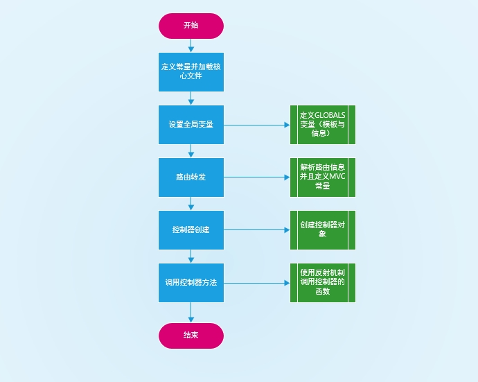

# Rice PHP框架
Rice轻量级PHP框架
<p align="center">
<a href="https://packagist.org/packages/rice/rice"></a>
</p>

##框架流程



#安装
```
composer composer create-project rice/rice
```
注意刚刚composer下来后Caches目录要赋予权限，不然无法生成缓存文件
```
cd rice
chmod -R 777 Caches
```

#使用介绍
可以仿照Test模块进行开发

App目录

Test-模块
    
-    Controller-文件夹
    
-    Model-文件夹
 
-    Tpl-文件夹

创建的文件都要首字母大写

App-Test-Controller-Index.php

```
    //测试
    public function Index(){

        $this->assign('test','test 123');
        $this->display();
    }
```
App-Test-Model-Index.php
```$xslt
    public function index(){
        //$db = Db::getInstance();
        // $sql = "SELECT `id` FROM `test` WHERE `status`=:status;";
        // $info = $db->query($sql)->bind(array('status'=>1))->fetchAll();
    }
```
App-Test-Tpl-Index.php
```$xslt

$cache = \Rice\Core\Core::get('Cache');

var_dump($cache->test);
```
